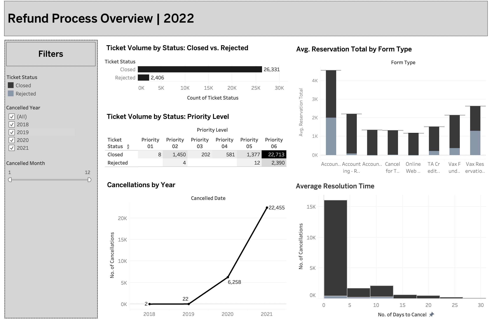

# Refund Resolution Analysis
## About 

The **Refund Resolution Analysis** project aims to uncover key insights into the refund processing workflow for a client of Infarsight. This analysis dives into refund request data, identifying trends, bottlenecks, and improvement opportunities in the refund resolution process. By closely examining factors like ticket status, escalation reasons, and processing times, the project provides actionable data-driven insights to enhance efficiency and customer satisfaction.

## Impact
This analysis provides several benefits:

- Improved Customer Satisfaction: By reducing delays and identifying common issues, the client can offer a better refund experience.
- Increased Efficiency: Insights into processing times highlight areas where the client can streamline operations and reduce costs.
- Data-Driven Decisions: Visualized data helps the client make informed choices to improve the refund workflow.

## Usage

1. Clone the repository to your local machine using Git:
`git clone https://github.com/pragszz/Refund_Resolution_Analysis.git`

2. Open the terminal and navigate to the Sleep-Health-and-Lifestyle directory:
`cd Refund_Resolution_Analysis`

4. Run the Analysis (Jupyter Notebook):
`jupyter notebook`

5. View Results

## Dependencies

| Package           | Version   |
|-------------------|-----------|
| ipython           | 8.15.0    |
| pandas            | 2.2.2     |

## Final Result

Note: The visualization presented was developed using Tableau.
